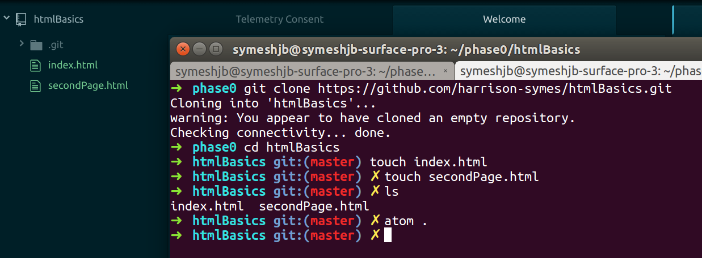
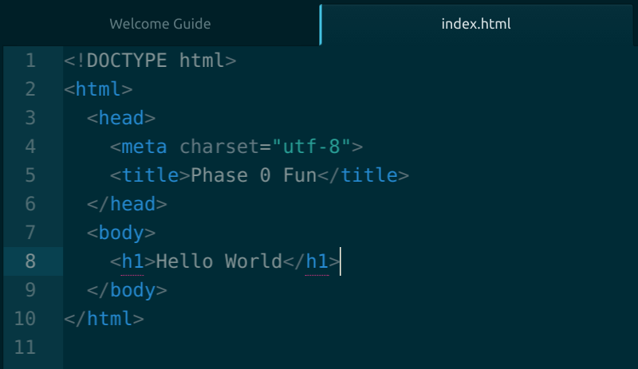
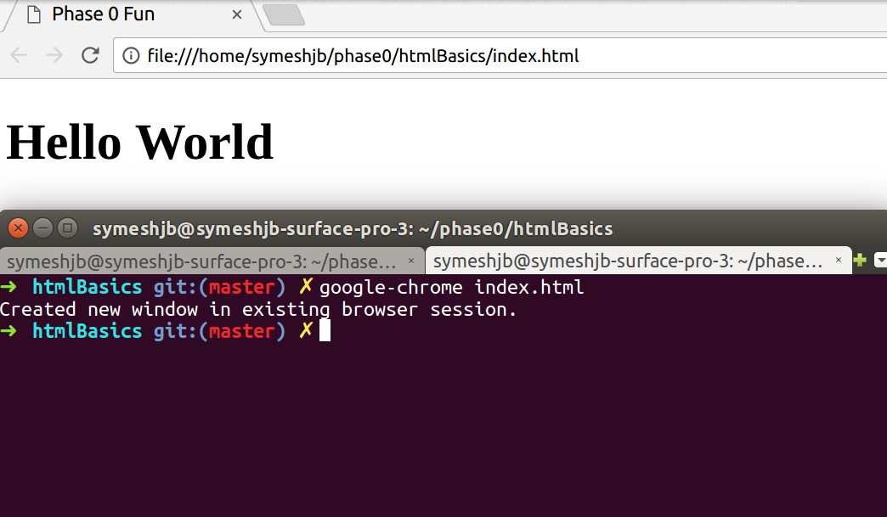

# Creating and Viewing a basic HTML page

- By Harrison Symes for EDA phase 0 students
- Helpful for Sprint 1, task 1.3

#### Links
  [Setting up your files](#setup)

### Setup
  * To get started, create and clone down a new repository where you will be creating your pages
  * Navigate to your repo in your terminal, and run the command `touch index.html` to page a file for your main page
    * It is convention to name your home page **index.html**
    * The `.html` extension is important for the file to be recognised as an HTML file
  * Let's also make a second page for later on. Call it whatever you want, for this example, I will call it **secondPage.html**, so I'll run `touch secondPage.html` to create it
  
  * Finally, open up your files in atom by running `atom .` This will open your whole directory in atom, so you can view and edit your two files
  
  It should look like this ^

### Html Template

```HTML
<!DOCTYPE html>
<html>
  <head>
    <meta charset="utf-8">
    <title></title>
  </head>
  <body>

  </body>
</html>
```

  * Copy the HTML template from above and paste it into both your **index.html** and whatever you called your other **.html** file
  * Give your page a **title** by inserting some text in between the opening `<title>` and closing `</title>` tags. This title is what will display on the browser tab when a user has your page open
    * For example, I am going to call my page `Phase 0 Fun`, so I have the line `<title>Phase 0 Fun</title>` in the head of my html
  * The best way to check that anything in code works, is to start with a **Hello World**, so in between the opening and closing `<body>` tags, insert the line `<h1>Hello World</h1>`


  

  It should look something like this ^

  * Give your second page a title as well, and maybe a hello world with different text


### Viewing your web page

* On your terminal / command-line, navigate to your repo's directory
* From your repo, run the command `google-chrome index.html`
  * If you don't have google-chrome, or your terminal does not recognise the command, you can always use your regular file browser (GUI), right click the index.html file, and choose `open with` and your browser of choice
  

* Hopefully you will see your title in the tab and your **Hello World** displayed in your browser
